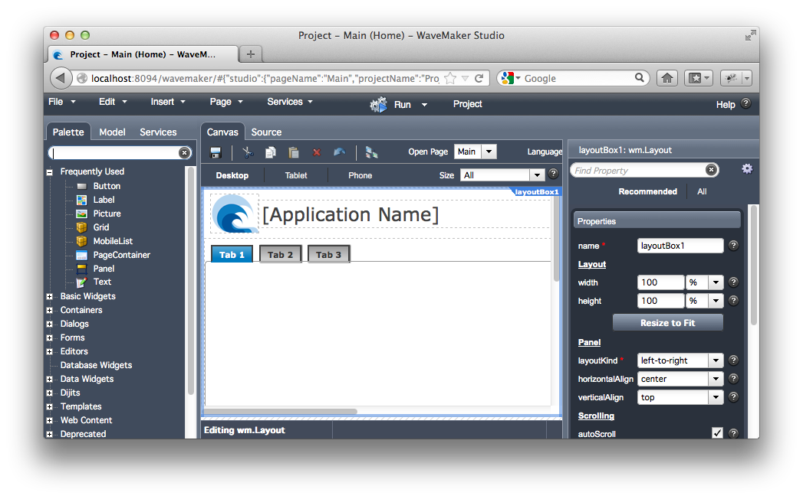

<!SLIDE cover>
# Practical Cloud Foundry #

## Phil Webb ##

<!SLIDE>

# Welcome #

* https://github.com/philwebb/practical-cloudfoundry
* Apache 2.0 licensed
* twitter: @phillip_webb

<!SLIDE center>

 

<!SLIDE>

# WaveMaker #

* Local web application
* Projects saved on disk
* Uses JDK Java compiler
* Deploys to local tomcat

<!SLIDE>

# WaveMaker on Cloud Foundry #

* <del>Local</del> web application
* Projects saved <del>on disk</del>
* Uses <del>JDK</del> Java compiler
* Deploys <del>to local tomcat</del>

<!SLIDE>

# Talk Overview #

* Refactoring for the cloud
* File system
* Gateway timeouts
* Java compiler
* Standalone tomcat
* Micro cloud foundry tips

<!SLIDE>

# Cloud Compromises #

<!SLIDE>

# General Tips #

* Develop locally first
* Use micro cloud foundry
* Add logging
* Unit test

<!SLIDE subsection>

# Refactoring for the cloud

<!SLIDE subsection>

# Refactor &#8594; Extract Interface #

<!SLIDE>

# Example #

	@@@ java
	@Controller
	public class MainController {

		@RequestMapping({ "/", "/index.html" })
		public ModelAndView index() {
			return new ModelAndView("index", 
				Collections.singletonMap("username", 
					System.getProperty("user.name")));
		}
	}
	
<!SLIDE>

# Example #

	@@@ java

					System.getProperty("user.name")
	
<!SLIDE>

# Example #

	@@@ java
	public interface UserDetails {
		String getUsername();
	}

<!SLIDE>

# Example #

	@@@ java
	public interface UserDetails {
		String getUsername();
	}

	@Component
	public class LocalUserDetails implements UserDetails {

		@Override
		public String getUsername() {
			return System.getProperty("user.name");
		}
	}

<!SLIDE>

# Example #

	@@@ java
	@Controller
	public class MainController {

		@Autowired
		private UserDetails userDetails;

		@RequestMapping({ "/", "/index.html" })
		public ModelAndView index() {
			return new ModelAndView("index", 
				Collections.singletonMap("username", 
					userDetail.getUsername()));
		}
	}

<!SLIDE subsection>

# New &#8594; Class #

<!SLIDE>

# Example #

	@@@ java
	@Component
	public class CloudUserDetails implements UserDetails {

		@Override
		public String getUsername() {
			return CloudEnvironment.current().getUser();
		}
	}

<!SLIDE>

# #FAIL #

<pre>
org.springframework.beans.factory.NoSuchBeanDefinitionException: 
<strong style="font-size: 2em;">No unique bean</strong> of type [org.cloudfoundry.practical.
demo.core.UserDetails]  is defined: expected single matching 
bean but <strong style="font-size: 2em;">found 2</strong>: [<em>localUserDetails</em>, <em>cloudUserDetails</em>]

at org.springframework.beans.factory.support....
</pre>

<!SLIDE>

# Never the twain shall meet #

* Local or Cloud Strategy
* Use Build System 
	* e.g. Maven Dependencies
* Use Spring Profiles

<!SLIDE>

# Spring profiles in XML #

	@@@ xml
	<beans profile="default">
		<bean class="org.cloudfoundry.practical.demo.
			local.LocalUserDetails">
	</beans>

	<beans profile="cloud">
		<bean class="org.cloudfoundry.practical.demo.
			cloud.CloudUserDetails"
	</beans>

<!SLIDE>

# Spring profiles in code #

	@@@ java
	package org.cloudfoundry.practical.demo.local;

	@Configuration
	@Profile("default")
	@ComponentScan
	public class LocalConfiguration {
	}

	package org.cloudfoundry.practical.demo.cloud;

	@Configuration
	@Profile("cloud")
	@ComponentScan
	public class CloudConfiguration {
	}

<!SLIDE>

# Gotcha #

* Cloud foundry Servlet 2.5 means web.xml

	
	@@@ xml
	<param-name>contextClass</param-name>
	<param-value>
		org.springframework.web.context.support.
			AnnotationConfigWebApplicationContext
	</param-value>

	<param-name>contextConfigLocation</param-name>
	<param-value>
		org.cloudfoundry.practical.demo.RootConfiguration
	</param-value>

<!SLIDE subsection>

# Profiles Demo #

<!SLIDE>

# Recap #

* Identify the features from your code to abstract

<!SLIDE>

# Recap #

* Define the interface and make existing code the implementation

<!SLIDE>

# Recap #

* Create cloud and local variants

<!SLIDE>

# Environment Variables #

	$ vmc env-add myapp key=value

	@@@ java
	public void example() {
		String value = System.getEnv("key")
		// ... do something with value
	}

	// or if a spring bean

	@Value("#{systemEnvironment['key']}")
	private String value;

<!SLIDE subsection>

# File System #

<!SLIDE>

# File System #

* Local storage will disappear when you application stops, crashes or moves
* Mongo GridFS is an alternative
* There are limits
	* 2GB Disk
	* 240MB Mongo
* Blobstore is coming

<!SLIDE>

# Resource Abstraction #

	@@@ java
	package org.cloudfoundry.tools.io;

	public interface Resource {
		// ...
	}

	public interface Folder extends Resource {
		// ...
	}

	public interface File extends Resource {
		// ...
	}

<!SLIDE>

# Local implementation #

	@@@ java
	Folder folder = new LocalFolder("/path/on/disk");

	File file = folder.getFile("subfolder/file.txt");
	InputStream stream = file.getContent().asInputStream();
	try {
		// do something ...
	} finally {
		stream.close();
	}

<!SLIDE>

# Mongo implementation #

	@@@ java
	Folder folder = new MongoFolder(db, "bucket");

	File file = folder.getFile("subfolder/file.txt");
	InputStream stream = file.getContent().asInputStream();
	try {
		// do something ...
	} finally {
		stream.close();
	}

<!SLIDE>

# Embrace the change #

* If you need to change your code, make it better
* Design your API around **your** needs
* Make it hard to do the wrong thing

<!SLIDE>

# Example #

	@@@ java
	import java.io.File;

	public void someMethod(File folder) {
		if(!folder.isDirectory()) {
			throw new IllegalArgumentException("Must be a folder");
		}
		// ...
	}

<!SLIDE>

# Example #

	@@@ java
	import org.cloudfoundry.tools.io.Folder;

	public void someMethod(Folder folder) {
		// ...
	}

<!SLIDE>

# Example #

	@@@ java
	import java.io.File;

	public void someMethod(File file) throw IOException {
		StringBuffer content = new StringBuffer();
		Reader reader = new FileReader(filePath));
		try {
			char[] buf = new char[1024];
			int numRead=0;
			while((numRead=reader.read(buf)) != -1){
				String readData = String.valueOf(buf, 0, numRead);
				fileData.append(readData);
				buf = new char[1024];
			}
		finally {
			reader.close();
		}
		// do something with content
	}

<!SLIDE>

# Example #

	@@@ java
	import org.cloudfoundry.tools.io.File;

	public void someMethod(File file) {
		String content = file.getContent().asString();
		// do something with content
	}

	// Only throws RuntimeExceptions, IOException is wrapped

.notes Highlight no IOException

<!SLIDE>

# Content #

	@@@ java
	file.getContent()

		String asString();
		byte[] asBytes();

		InputStream asInputStream();
		OutputStream asOutputStream();
		
		Reader asReader();
		Writer asWriter();

		void write(String content)
		void write(InputStream content)
		void write(Reader content);

		void copyTo(OutputStream outputStream)
		void copyTo(Writer writer)

<!SLIDE>

# Resources and filtering

	@@@ java

	// recursively delete backup files
	folder.find().files().include(
			FilterOn.names().ending(".bak")
		).delete();

	// copy immediate folders (excluding *.~*)
	folder.list().folders().exclude(
			FilterOn.antPattern("*.~*")
		).copyTo(destinationFolder);

<!SLIDE>

# Zip Files #

	@@@ java

	// Create a zip stream
	InputStream zipStream = ZipArchive.compress(folder);

	// Unpack a zip
	ZipArchive.unpack(zipStream, destinationFolder);

	// Read a zip file as if it is a folder
	Folder zip = new ZipArchive(file);
	zip.getFile("/inside/zip/file.txt").getContent().asString();

.notes Compress can handle resources

<!SLIDE>

# Virtual Folders #

	@@@ java
	// Virtual folder exist in memory
	Folder folder = new VirtualFolder();
	folder.getFile("/a/b.txt").getContent().write("in memory")

	// Only overwritten data consumes space
	otherFolder.copyContentsTo(folder);
	folder.getFile("a.txt").getContent().write("replaced");
	folder.getFile("b.txt").getContent().asString();

<!SLIDE subsection>

# File System Demo #

<!SLIDE>

# How to @Configure mongo #

	@@@ java
	@Configuration
	@Profile("cloud")
	@ComponentScan
	public class CloudConfiguration {

		@Autowired
		private MongoDbFactory mongo;

		@Bean
		public CloudMongoDbFactoryBean mongo() {
			return new CloudMongoDbFactoryBean();
		}
	}

<!SLIDE> 

# Security #

	@@@ xml
	<security:http>
		<security:http-basic />
		<security:logout />
		<security:intercept-url pattern="/dav/**" 
			access="ROLE_WEBDAV" />
	</security:http>
	
	<bean name="cloudFoundryAuthenticationProvider" 
			class="org.cloudfoundry.tools.security.
						CloudFoundryAuthenticationProvider">
		<property name="authorities" value="ROLE_WEBDAV"/>
	</bean>
	
	<security:authentication-manager>
		<security:authentication-provider 
			ref="cloudFoundryAuthenticationProvider"/>
	</security:authentication-manager>

<!SLIDE >

# Gotcha #

* OSX Finder with WebDav does not work
* Transfer-Encoding: chunked fails*
* Finding problems like this can be hard
	* Use server logs
	* Use packet sniffing (Wireshark)

* http://stackoverflow.com/questions/8528600/how-to-make-a-chunked-request-via-nginx

<!SLIDE subsection>

# Gateway Timeouts #

<!SLIDE>

# 504 Gateway Timeouts #

* You are not the only thing in the cloud
* Sockets / File Handles are a commodity
* You will be cut off after 30-60 seconds without traffic

<!SLIDE>

# Drip Feeding #

	@@@ java

	// If you keep data flowing you will not timeout

	@RequestMapping("/drip")
	public void drop(HttpServletResponse response) throws IOException {
		ServletOutputStream outputStream = response.getOutputStream();
		while(gotWorkToDo()) {
			String fragment = doSomeWork(); // < 30 secs
			outputStream.write(fragment);
			response.flushBuffer();
		}
	}

<!SLIDE>

# Long Polling #

<!SLIDE>

# Long Polling #

<!SLIDE>

# Long Polling #

<!SLIDE>

# Long Polling #

<!SLIDE>

# Long Polling #

<!SLIDE>

# Long Polling #

<!SLIDE>

# Long Polling #

<!SLIDE>

# Long Polling #

<!SLIDE>

# Long Polling #

<!SLIDE>

# Long Polling #

<!SLIDE>

# Long Polling #

<!SLIDE>

# Long Polling #

<!SLIDE>

# Long Polling #

<!SLIDE>

# Long Polling #

<!SLIDE>

# Long Polling #

<!SLIDE>

# Long Polling #

<!SLIDE>

# Long Polling #

<!SLIDE>

# Long Polling #

<!SLIDE>

# Long Poll Client Shim #

	@@@ html
	<script type="text/javascript" 
		th:src="@{/cloudfoundry/dojo-xhr-timeout-shim.js}"/>

	@@@ javascript
	dojo.xhrPost({
		url : requestUrl,
		load : function(result) {
			// handle the result
		},
		error : function(result,ioargs) {
			// handle the error
		}
	});

<!SLIDE>

# Long Poll Server Shim #

	@@@ xml
	<filter>
		<filter-name>timeoutProtectionFilter</filter-name>
		<filter-class>org.springframework.web.filter.
				DelegatingFilterProxy</filter-class>
	</filter>

	<filter-mapping>
		<filter-name>timeoutProtectionFilter</filter-name>
		<servlet-name>dispatcherServlet</servlet-name>
	</filter-mapping>

<!SLIDE>

# Long Poll Server Shim #

	@@@ java
	@Bean
	public TimeoutProtectionFilter timeoutProtectionFilter() {
		TimeoutProtectionFilter filter = 
			new TimeoutProtectionFilter();
		filter.setProtector(timeoutProtectionStrategy());
		return filter;
	}

	@Bean
	public TimeoutProtectionStrategy timeoutProtectionStrategy() {
		return new ReplayingTimeoutProtectionStrategy();
	}

<!SLIDE subsection>

# Timeout Demo #

<!SLIDE subsection>

# Java Compiler #

<!SLIDE>

# Java Compiler #

* Cloud Foundry does not include a JDK
* JSR199 <tt>ToolProvider.getSystemJavaCompiler()</tt> not an option
* Eclipse compiler works with JRE but has bugs*
* Work around using <tt>org.cloudfoundry.tools.compiler.CloudFoundryJavaCompiler</tt>

*https://bugs.eclipse.org/bugs/show_bug.cgi?id=188796

<!SLIDE>

# Java Compiler #

	@@@ java
	CloudFoundryJavaCompiler compiler = 
		new CloudFoundryJavaCompiler();
	
<!SLIDE>

# Java Compiler #

	@@@ java
	CloudFoundryJavaCompiler compiler = 
		new CloudFoundryJavaCompiler();
	
	StandardJavaFileManager standardFileManager = 
		compiler.getStandardFileManager(null, null, null);

	ResourceJavaFileManager fileManager = 
		new ResourceJavaFileManager(standardFileManager);
	

<!SLIDE>

# Java Compiler #

	@@@ java
	// Use org.cloudfoundry.tools.io.File 
	// or org.cloudfoundry.tools.io.Folder

	fileManager.setLocation(StandardLocation.CLASS_OUTPUT, 
			classOutputFolder);
	
	fileManager.setLocation(StandardLocation.SOURCE_PATH, 
			sourceFolder);

	fileManager.setLocation(StandardLocation.CLASS_PATH, 
			jarFile1, jarFile2);

<!SLIDE>

# Java Compiler #

	@@@ java
	Iterable<? extends JavaFileObject> compilationUnits = 
		fileManager.list(StandardLocation.SOURCE_PATH, "", 
			Collections.singleton(JavaFileObject.Kind.SOURCE), 
			true);

	CompilationTask task = compiler.getTask(null, fileManager, 
		null, Arrays.asList("-encoding", "utf8"), null, 
		compilationUnits);

	task.call(); // returns true on success

<!SLIDE subsection>

# Compiler Demo #

<!SLIDE subsection>

# Standalone Tomcat #

<!SLIDE>

# Standalone Tomcat #

* Tomcat 7 can be used with Cloud Foundry*
* Bundle as a standalone application
* Modify <tt>catalina.sh</tt> and <tt>startup.sh</tt>*

*http://blog.cloudfoundry.org/2012/06/18/deploying-tomcat-7-using-the-standalone-framework/

<!SLIDE>

# Standalone Tomcat with Maven #

* Maven dependency

	@@@ xml
	<dependency>
		<groupId>${project.groupId}</groupId>
		<artifactId>cloudfoundry-tomcat-standalone</artifactId>
		<version>${project.version}</version>
		<type>tar.gz</type>
		<scope>runtime</scope>
	</dependency>

https://github.com/ericbottard/cloudfoundry-tomcat-7

<!SLIDE>

# Standalone Tomcat with Maven #

* Assembly plugin

	@@@ xml
	<artifactId>maven-assembly-plugin</artifactId>

	<goal>attached</goal>

	<configuration>
		<descriptors>
			<descriptor>${basedir}/src/assembly/
				cloudfoundry-tomcat-standalone.xml</descriptor>
		</descriptors>
		<appendAssemblyId>false</appendAssemblyId>
		<finalName>cloudfoundry-tomcat-standalone</finalName>
	</configuration>

<!SLIDE>

# Standalone Tomcat with Maven #

* Assembly XML

	@@@ xml
	<dependencySet>
		<outputDirectory>/</outputDirectory>
		<unpack>true</unpack>
		<includes>
			<include>
				${project.groupId}:cloudfoundry-tomcat-standalone
			</include>
		</includes>
	</dependencySet>

	<outputDirectory>/webapps/ROOT</outputDirectory>

<!SLIDE>

# Gotcha #

* Cloud profile no longer enabled
* Mongo host not auto-reconfigured
* Need a CloudApplicationContextInitializer*

	@@@xml
	<context-param>
		<param-name>contextInitializerClasses</param-name>
		<param-value>
			org.cloudfoundry.reconfiguration
				.spring.CloudApplicationContextInitializer
		</param-value>
	</context-param>

*https://github.com/cloudfoundry/vcap-java

<!SLIDE subsection>

# Tomcat Demo #

<!SLIDE subsection>

# Micro Cloud Foundry Tips #

<!SLIDE>

# Micro Cloudfoundry Tips #

* Give your VM more memory
* Watch your disk usage
* Use snapshots
* Watch your clock

<!SLIDE>

# Use vcap.me #

* Install local DNS

<pre>$ brew install dnsmasq</pre>

<pre class="conffile">
# /usr/local/etc/dnsmasq.conf
address=/cvap.me/127.0.0.1
listen-address=127.0.0.1
</pre>

* Tunnel the connection

<pre>$ sudo ssh -L 80:192.168.129.142:80 vcap@192.168.129.142</pre>

http://blog.cloudfoundry.com/2011/09/08/working-offline-with-micro-cloud-foundry/

<!SLIDE>

# Change NGINX Timeouts

	$ ssh vcap@api.vcap.me

	$ sudo apt-get install vim
	$ sudo vim /var/vcap/jobs/router/config/nginx.conf

<pre class="conffile">
	<em># around line 66</em>

	proxy_send_timeout 3000;
	proxy_read_timeout 3000;
</pre>

	$ sudo monit restart nginx

<!SLIDE subsection>

# Summary #

<!SLIDE>

# Summary #

* You need to work to get the benefits of cloud computing 
* Expect to make changes
* Take the opportunity to improve your code
* Reuse this source code

<!SLIDE subsection>

# Thank You! #

